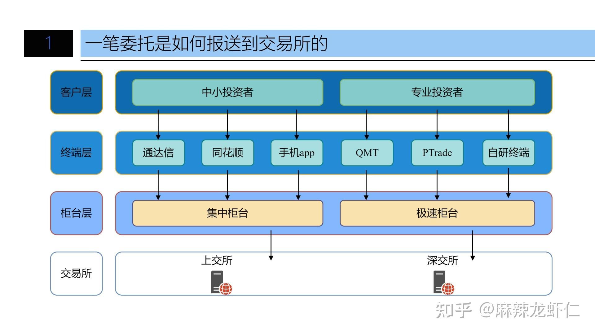

### QMT量化交易软件

竞对产品：PTrade、easyTrade、各个券商自研等 
特点：  

- QMT本地执行，灵活安全
- PTrade需要提交券商服务器
- easyTrader，资金门槛最低，开发难度最高，稳定性一般（模拟鼠标），灵活性最好

### 参考
- [QMT和XTP的关系](https://zhuanlan.zhihu.com/p/627756201)
- 
- [easyTrader](https://easytrader.readthedocs.io/zh/master/)