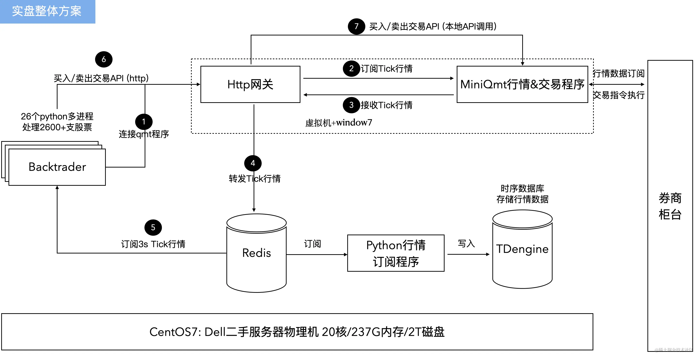

### [backtrader](https://www.backtrader.com/)

首先实盘一个策略需要以下几部分功能支持：
- 数据获取
- 策略编写&执行
- 回测评估
- 交易API

这类回测框架，封装了上面的基本功能模块，并且封装了一些基本的因子策略。

[使用实例](https://github.com/soulmachine/crypto-notebooks/blob/master/backtest/Clenow-trend-following.ipynb)

- backtrader和QMT的关系？
  - backtrader支持回测（backtrader）、模拟盘（paper trading）、实盘（live trading），但是不支持国内的交易市场；
  - QMT是国内很多券商交易柜台支持的交易软件，也提供了策略编写、回测、实盘等能力；
  - miniQmt是QMT的内置功能，轻量级QMT，仅支持获取数据和实盘交易；
  - 所以可以选择开源的比如backtrader来编写策略，通过miniQmt来实现实盘交易； 

### 参考

- [实盘量化方案](https://juejin.cn/post/7289748806437863424)
  - 