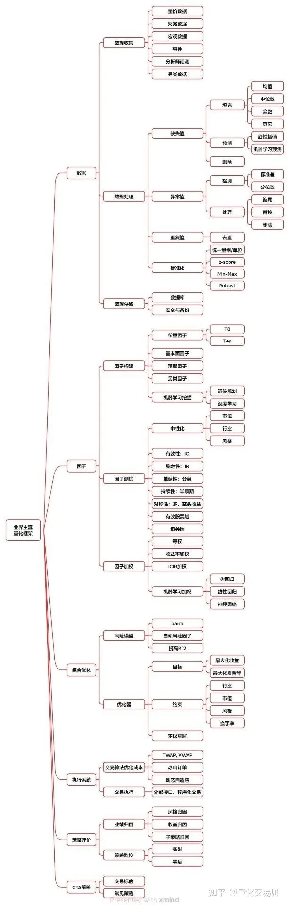

[一文读懂"多因子量化模型"](https://zhuanlan.zhihu.com/p/684300637)
来自知乎

文章提到的alpha和beta来自于夏普的CAMP模型，收益分为以下几部分：
- 风格收益(β)：简单讲就是指数收益，或者大盘收益，跟随大盘波动
- 选股收益(α)：选股收益，也就是在大盘收益之上的超额收益
- 交易收益，T0算法？

“目前，多因子是量化投资中的主流 Alpha 策略，它通过结合多个具有预测能力的因子来构建投资组合。因此， 有效因子的数量以及因子之间的独立性是构建和评价量化策略的关键。”

上面的要求需要因子满足白盒且可控，这个是目前DL模型所不具备的。因为是个黑盒策略，很多时候可控也做不到，神经网络的学习本身是一个高阶非线性函数拟合的过程。

文章提到了中性收益，中性收益是指的去除指数波动外的收益，因为多因子本质是在做多股票，假如对冲手段是做空指数，那么假如选股策略可以获得稳定的超额收益，那么无论市场怎么变化，选股+对冲策略可以获得稳定的中性收益。
中性收益和超额收益没有必然联系，是两部分策略的收益；

“量化投资策略的构建过程是：数据处理->因子构建->因子加权->组合优化->交易执行。”
数据丰富性——>因子丰富程度->策略上限
因子共线性消除->类似电商中的GAUC和debias的做法，避免数据过拟合，导致小部分模式主导模型学习；
组合优化：这部分是搜推广中不常存在的，顶多是在券投放和重排等业务和技术模块中存在部分。

