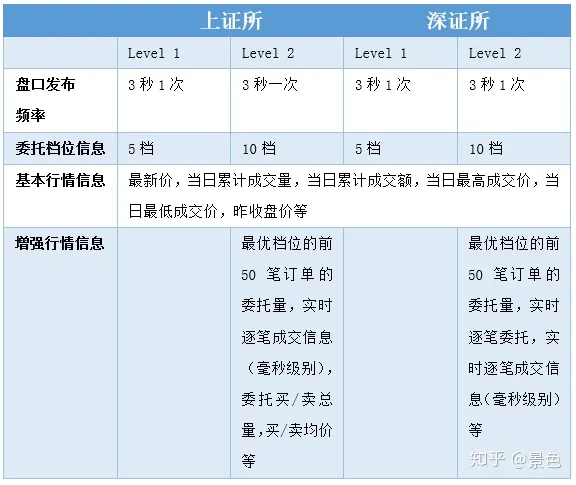

来源：https://hftquant.com/gitbook/2.1%E4%BA%8C%E7%BA%A7%E5%B8%82%E5%9C%BA%E7%AE%80%E4%BB%8B.html

基本术语：

- tick数据：即逐笔行情，逐笔委托和逐笔成交
- 快照行情(order book or limit order book)：是对tick行情数据的某一个时刻的切片数据。例如现在常见的期货500ms一笔的行情，就是每500ms，在这时间段内的最高价、最低价、成交量等汇总成的一笔快照行情。
- 股票行情又分为level1 和 level2 (十档委托)，有些app提供了SZ市场超级L2，即1000档的行情
  - 十档：按照price取top 10；
- (market order)市价单及直接按照盘口价格下单，直接促成交易
- (limit order)限价单及盘口外的价格下单，等待符合预期的价格成交

股票

- 集合竞价和连续竞价：集合竞价是指在规定时间内接受的买卖申报一次性集中撮合的竞价方式。连续竞价是指对买卖申报逐笔连续撮合的竞价方式。
- 交易原则： 价格优先，时间优先。即价格更优的报单更早成交，同样价格的报单先报的先成交
- 交易时间： 每个交易日的9:15至9:25为开盘集合竞价时间，9:30至11:30、13:00至15:00为连续竞价时间。（深交所最后3分钟是收盘集合竞价）
- 交易单位： 通过竞价交易买入股票、基金、权证的，申报数量应当为100股（份）或其整数倍。股票的报价单位为N元每股。
- 涨跌幅： 本所对股票、基金交易实行价格涨跌幅限制，涨跌幅比例为10%，10%相对于昨日收盘价。但是也有例外的情况例如上市交易首日。
- T+1 交易： T日买入的股票第二天才能卖出
- 多空： 只能做多不能做空
- 手续费和印花税： 股票交易需要支付一定的手续费和印花税，手续取决于交易所和券商

- 逐笔数据一般是针对深交所的股票而言（000和300开头）。上交所（600开头）只有trade逐笔数据，且为每3S推送一次，使用价值不大。
  - 上证所level2行情提供的实时逐笔成交信息，一开始是3s推送一次，20191202后改为实时推送，现在还没有逐笔委托信息。深证所level2实时提供了逐笔委托和逐笔成交信息，是深市上的全部行情信息。市面上常见的深市千档行情数据即利用这两个信息合成而出。
- 基于Db将逐笔数据合成高频订单薄，https://zhuanlan.zhihu.com/p/692598778
  - 通常交易所可以提供实时和历史的行情快照数据，快照中除订单簿以外还包括最新成交价等成交信息。以沪深两市的股票为例，交易所提供了 3 秒频率的 10 档订单簿，也称为 Level-2 快照。随着高频量化交易的发展和实时处理系统能力的提升，3 秒频率的订单簿已经无法满足 T0 等高频策略的需求。
- 在订单流的实际使用过程中，一般超短线、高频要用到逐笔委托和逐笔成交，日内波段周期以上一般用到宽泛意义上的快照数据

来源 https://xueqiu.com/9086082259/284386968#:~:text=%E6%98%AF%E6%8C%87%E4%BA%A4%E6%98%93%E8%80%85%E5%9C%A8%E4%BA%A4%E6%98%93%E6%89%80%E6%88%96%E5%85%B6%E4%BB%96%E4%BA%A4%E6%98%93%E5%B9%B3%E5%8F%B0%E4%B8%8A%E6%8F%90%E4%BA%A4%E7%9A%84%E4%B9%B0%E5%8D%96%E8%AE%A2%E5%8D%95%EF%BC%8C%E5%AE%83%E4%BB%AC%E6%8C%89%E7%85%A7%E6%8F%90%E4%BA%A4%E7%9A%84%E6%97%B6%E9%97%B4%E9%A1%BA%E5%BA%8F%E6%8E%92%E5%88%97%EF%BC%8C%E5%B9%B6%E6%98%BE%E7%A4%BA%E8%AE%A2%E5%8D%95%E7%9A%84%E4%BB%B7%E6%A0%BC%E3%80%81%E6%95%B0%E9%87%8F%E3%80%81%E6%96%B9%E5%90%91%E5%92%8C%E6%97%B6%E9%97%B4%E3%80%82,%E9%80%90%E7%AC%94%E5%A7%94%E6%89%98%E5%8F%AF%E4%BB%A5%E5%8F%8D%E6%98%A0%E5%B8%82%E5%9C%BA%E7%9A%84%E4%BE%9B%E6%B1%82%E5%8E%8B%E5%8A%9B%EF%BC%8C%E4%BB%A5%E5%8F%8A%E4%BA%A4%E6%98%93%E8%80%85%E5%AF%B9%E4%BB%B7%E6%A0%BC%E8%B5%B0%E5%8A%BF%E7%9A%84%E9%A2%84%E6%9C%9F%E3%80%82%20%E4%BE%8B%E5%A6%82%EF%BC%8C%E5%81%87%E8%AE%BE%E6%9F%90%E5%8F%AA%E8%82%A1%E7%A5%A8%E7%9A%84%E6%9C%80%E6%96%B0%E6%88%90%E4%BA%A4%E4%BB%B7%E4%B8%BA10%E5%85%83%EF%BC%8C%E4%B9%B0%E4%B8%80%E4%BB%B7%E4%B8%BA9.99%E5%85%83%EF%BC%8C%E5%8D%96%E4%B8%80%E4%BB%B7%E4%B8%BA10.01%E5%85%83%E3%80%82
