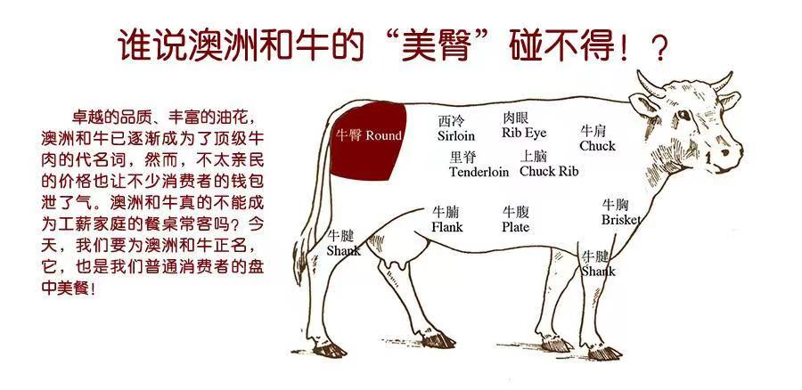
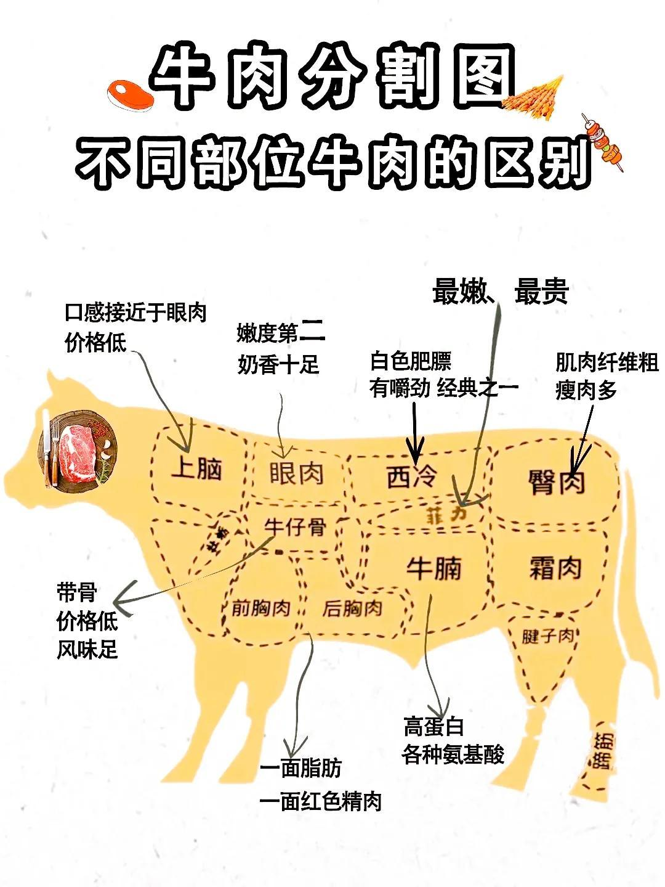

今天出去吃了牛排,记录下:

- 1、和牛是日本的一个牛的品种，是本地牛和外来牛杂交出来的品种；后出口到澳洲等地，但是目前日本和牛活牛不再出口；
- 2、曾经有一段时间国内禁止进口日本和牛，所以澳洲和牛比较普及；
- 3、日本和牛分级A1-A5，澳洲分M1-M9；数字越高越贵；通过雪花来对牛肉等级判定；
- 4、和牛位置排名：西冷>眼肉>上脑 
- 5、如何煎牛排：纸巾吸干表面水分，不要用水洗，200度热锅直接煎，因为和牛本身油比较多，所以不用放油(或者用和牛肉边牛油先煎一下)；不要快速翻面，一面煎充分再翻面；不需要放任何调味品；